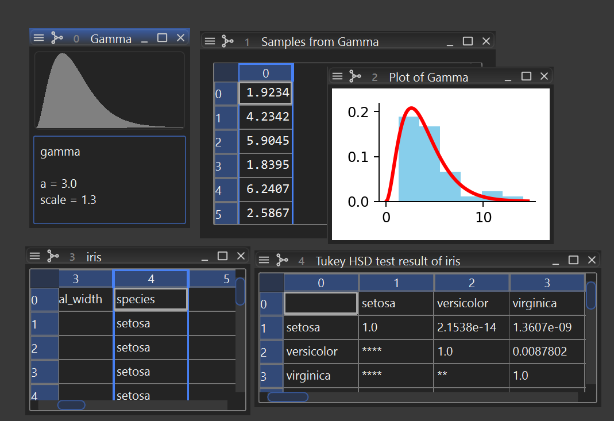

# himena-stats

[](https://pypi.org/project/himena-stats)
[](https://pypi.org/project/himena-stats)



A [himena](https://github.com/hanjinliu/himena) plugin for statistical testing and
modeling using `scipy.stats` and `scikit-posthocs`.

-----

## Installation

```console
pip install himena-stats
```

```console
himena <my-profile> --install himena-stats
```
